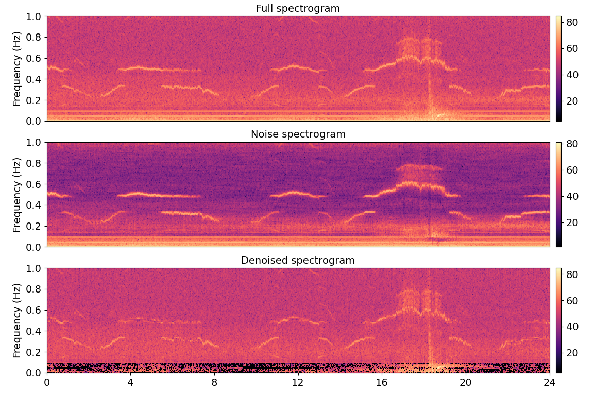

# NoiseCut
OBS noise reduction from horizontal and vertical components using harmonic-percussive
separation algorithms

## Example of one day OBS signal
After installing the package, in order to denoise a signal you can use the following code. The outputs are the denoised signal and the spectrogram as below.The spectrogram shows only the frequency range of [0-1] Hz.

import noisecut                                                                                                                                                          
import obspy

st = obspy.read('D10.DO.HH4..D.2012.080.000000')                                                                                       
hps_trace, spectrograms = noisecut.noisecut(st[0], ret_spectrograms=True)                                                  
noisecut.plot_noisecut_spectrograms(*spectrograms)

## Installation

For the installation you need to clone the repository. Then run "python setup.py install" in the terminal. 
You need the Numpy version of 2.21.

## Licence

NoiseCut is licenced under the [GNU Affero General Public License
(AGPLv3)](LICENSE).

## Contact

* Author: Zahra Zali, zali@uni-potsdam.de
